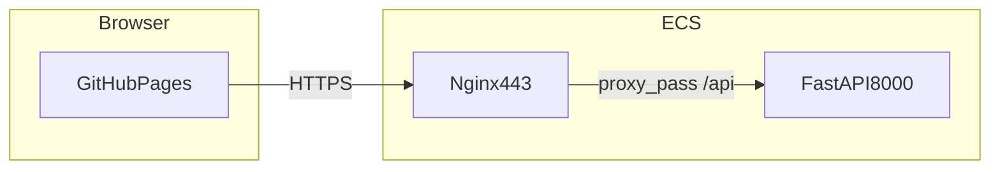

# happfri：由浅入深学习 + 阶段面试题

本文件落实仓库学习计划：按阶段阅读代码、口述逻辑；每阶段末用面试题自测（建议先闭卷口述，再对照「要点提示」）。

---

## 项目一句话（面试开场）

- **前端**：Vue 3 + TypeScript + Vite + Vue Router + Pinia；题库上传后经 API 解析，浏览器内答题与记分。
- **后端**：FastAPI（`backend/app/main.py`）解析 Word / PDF / Excel。
- **线上**：GitHub Pages 托管静态资源；API 为自建域名 HTTPS（如 `https://api.iww.pub`），经 Nginx 反代到本机 Uvicorn。

---

## 阶段 1：能跑起来 + 目录在干什么

### 学习目标

1. 本地运行：`npm run dev`。
2. 读入口与壳：
   - [src/main.ts](../src/main.ts)：创建应用、注册 Pinia、Router、`mount('#app')`。
   - [src/App.vue](../src/App.vue)：仅 `<RouterView />`。
   - [src/router/index.ts](../src/router/index.ts)：路由表、`createWebHistory(import.meta.env.BASE_URL)`。
3. 用户动线（在浏览器里点一遍）：  
   [HomeView.vue](../src/views/HomeView.vue) → 上传抽屉 → [ItemView.vue](../src/views/ItemView.vue)（答题）→ [ScoreView.vue](../src/views/ScoreView.vue) 等。
4. 配置：[vite.config.ts](../vite.config.ts)  
   - 生产 `base`（子路径 `/happfri/` 或与 CI 中 `VITE_BASE_PATH` 一致）。  
   - 开发 `server.proxy['/api']` → `http://127.0.0.1:8000`。

### 部署回顾（你线上踩过的点）

- GitHub Pages 为 **HTTPS**；若 API 仍为 **`http://` 公网 IP**，浏览器 **Mixed Content** 会拦截 XHR。
- 解法：API 使用 **HTTPS 域名** + 有效证书；前端 `VITE_API_BASE_URL` 指向该 **https 根地址**（无尾斜杠）。

### 阶段 1 面试题

| # | 题目 |
|---|------|
| 1 | 为什么生产环境 `createWebHistory` 要用 `import.meta.env.BASE_URL`？子路径部署时错配会怎样？ |
| 2 | 开发时请求 `/api/...` 为什么能到本机 8000？是谁在转发？ |
| 3 | Mixed Content 是什么？为什么 GitHub Pages 上不能继续用 `http://公网IP` 调 API？ |

要点提示（先自答再看）

1. `BASE_URL` 与 Vite `base` 一致，路由 history 与静态资源路径才能对齐；错配会导致子路径下刷新 404、chunk 加载失败或路由错位。  
2. Vite 开发服务器的 **proxy** 把以 `/api` 开头的请求转发到 `127.0.0.1:8000`。  
3. HTTPS 页面请求 **明文 HTTP** 资源/接口时，浏览器安全策略可拦截；GitHub Pages 固定为 HTTPS，故 API 也须 HTTPS（或同域，本项目不同域）。

- [ ] 我已能不看文档口述阶段 1 三题

---

## 阶段 2：页面与组件数据流

### 学习目标

1. 上传：[src/components/UploadDrawer.vue](../src/components/UploadDrawer.vue) 如何选文件、调用解析。
2. API 层：[src/api/quiz.ts](../src/api/quiz.ts) — `axios.post`、`FormData`、`append('file', file)` 与后端字段名一致；[src/config/api.ts](../src/config/api.ts) 如何拼 `apiUrl('/api/parse-questions')`。
3. 首页：[src/components/HomeContent.vue](../src/components/HomeContent.vue) — `hasQuestions`、`router.push('/item')`。
4. 可选：[src/stores/ui.ts](../src/stores/ui.ts) 与界面提示、错误等。

### 阶段 2 面试题

| # | 题目 |
|---|------|
| 1 | `axios.post` 上传文件时，为什么不建议手写 `Content-Type: multipart/form-data`？ |
| 2 | 从用户选文件到 Pinia 里有题目，数据经过哪些模块/函数？（说清 3～4 个环节） |
| 3 | Vue Router 懒加载 `() => import(...)` 对首包体积有什么影响？ |

要点提示

1. multipart 需要 **boundary**，应由运行时自动带；手写常缺 boundary 导致服务端解析失败。  
2. 典型链：UploadDrawer（选文件）→ `parseQuizFile` → HTTP 响应 → store 写入 `questions`（具体以你读的组件/store 为准）。  
3. 路由组件按需拆 chunk，减小首屏 JS，首访可能多一次网络请求换首屏更快。

- [ ] 我已能口述阶段 2 三题

---

## 阶段 3：Pinia 与游戏状态（核心）

### 学习目标

精读 [src/stores/game.ts](../src/stores/game.ts)：

- 数据结构：`QuizQuestion`、`userAnswersMap`、`itemNum`、计时等。
- 计算属性：`currentTopic`、`hasQuestions`、`calculateScore` 等。
- 与视图：[ItemView.vue](../src/views/ItemView.vue)、[AnswerCardView.vue](../src/views/AnswerCardView.vue)、[AnswerDetailView.vue](../src/views/AnswerDetailView.vue)。

### 阶段 3 面试题

| # | 题目 |
|---|------|
| 1 | 为什么用 Pinia 而不是全用组件 `ref` 层层传递？各适合什么场景？ |
| 2 | 刷新页面题目丢失的原因是什么？可以怎样持久化（只讲思路）？ |
| 3 | 若「提交判分」改为异步请求后端，会动 store 里哪些点、视图层哪些点？ |

要点提示

1. 多视图共享同一业务状态时用 store 更清晰；局部 UI 仍可用组件状态。  
2. 默认仅存内存；可用 `sessionStorage`/`localStorage`、或重新拉取解析结果等。  
3. 例如将判分从本地计算改为 `await api.submit(...)`，更新 store 中用户答案或分数的写入时机与 loading 状态。

- [ ] 我已能口述阶段 3 三题

---

## 阶段 4：后端解析与接口契约

### 学习目标

1. [backend/app/main.py](../backend/app/main.py)：路由 `/api/parse-questions`、`CORSMiddleware`；**做法 A**：仅后端 CORS，Nginx **不要**再 `add_header Access-Control-*`，避免响应头重复。
2. [backend/app/parser.py](../backend/app/parser.py)：后缀分支、正则、`ValueError` → HTTP 422。
3. [backend/app/schemas.py](../backend/app/schemas.py) 与前端 [src/stores/game.ts](../src/stores/game.ts) 中 `QuizParseResult` 等类型对齐意识。

### 部署回顾

- **CORS 重复**：Nginx 与 FastAPI 同时写 `Access-Control-Allow-Origin` → 浏览器报多个值 → 只保留一层。  
- **405**：方法不允许（如 HEAD/GET 打 POST 路由）。  
- **422**：校验/业务失败（如缺 `file`、解析不到题目）。

### 阶段 4 面试题

| # | 题目 |
|---|------|
| 1 | 预检 OPTIONS 什么时候发？哪些请求头容易触发预检？ |
| 2 | 为什么 `allow_origins=["*"]` 与 `allow_credentials=True` 不能随意组合？ |
| 3 | 上传 `.doc` 时后端依赖什么？失败时常见 HTTP 状态？ |

要点提示

1. 跨域且「非简单请求」时浏览器先发 OPTIONS；自定义头、`Content-Type` 非简单类型等可触发。  
2. 带 credential 时浏览器要求 `Allow-Origin` 为具体源，不能用 `*`。  
3. 解析链里 `.doc` 常依赖 LibreOffice（`soffice`）转换；失败多为 422 或 500（视异常处理）。

- [ ] 我已能口述阶段 4 三题

---

## 阶段 5：构建、CI/CD 与线上排错

### 学习目标

1. 构建：`npm run build` → `dist`；`import.meta.env.VITE_API_BASE_URL` 在**构建期**写入包。  
2. [src/config/api.ts](../src/config/api.ts)：生产用完整 API 根；开发可空走 `/api`。  
3. [.github/workflows/deploy-pages.yml](../.github/workflows/deploy-pages.yml)：  
   - **Repository secret** `VITE_API_BASE_URL`（须 `https://`）；  
   - `VITE_BASE_PATH` 与仓库名；  
   - `dist` 校验避免误传开发版 `index.html`。  
4. GitHub Pages：**Source = GitHub Actions**；访问 **`https://<user>.github.io/happfri/`**（带子路径）。  
5. [scripts/copy-spa-fallback.mjs](../scripts/copy-spa-fallback.mjs)：`404.html` 与 SPA 刷新；[public/.nojekyll](../public/.nojekyll) 禁用 Jekyll。

### 阶段 5 面试题

| # | 题目 |
|---|------|
| 1 | 为什么 Secret 要写在 **Repository secrets**，当前 workflow 的 build 才能稳定读到？ |
| 2 | `dist/index.html` 里为何是 `/happfri/assets/index-*.js`？与 Vite `base` 的关系？ |
| 3 | Secret 改回 `http://` 后线上现象？如何用 DevTools 自查？ |

要点提示

1. 本 workflow 的 build job **未** `environment:`，故不会自动注入 Environment secrets；Repository secrets 通过 `secrets.VITE_API_BASE_URL` 传入。  
2. `base` 为资源与路由 history 的公共前缀；GitHub 项目页必须在子路径下提供静态文件。  
3. Mixed Content：Console 报错、Network 中请求 blocked；应用应改回 `https://` 并重新部署。

- [ ] 我已能口述阶段 5 三题

---

## 建议节奏（自定）

| 建议用时 | 阶段 | 产出 |
|----------|------|------|
| 第 1～2 天 | 1 | 口述技术栈、路由、代理、Mixed Content |
| 第 3～4 天 | 2 | 能画「上传 → store」简图 |
| 第 5～7 天 | 3 | 讲清 `game` store 与答题页联动 |
| 第 8～10 天 | 4 | 讲 API、CORS、422/405 |
| 第 11～14 天 | 5 | 复述 push → Actions → Pages + API 全链路 |

每阶段结束：**合上书与 IDE**，口述三题；卡壳处回到对应源文件做书签。

---

## 面试 1 分钟总串（背诵提纲）

Vue 3 + Vite，生产子路径部署 GitHub Pages；`VITE_API_BASE_URL` 在 CI **Repository secrets** 注入为 **HTTPS**，避免混合内容。FastAPI 监听本机，Nginx **443 反代 `/api`**；**CORS 只放在后端**，避免与 Nginx 重复头。上传用 **multipart** 字段 `file`；解析失败返回 **422**。答题状态由 **Pinia `game` store** 管理。

---

## 相关文档

- 生产环境变量说明：[.env.production.example](../.env.production.example)  
- Nginx 反代无 CORS 示例：[deploy/nginx-api-proxy-nocors.conf.example](../deploy/nginx-api-proxy-nocors.conf.example)
