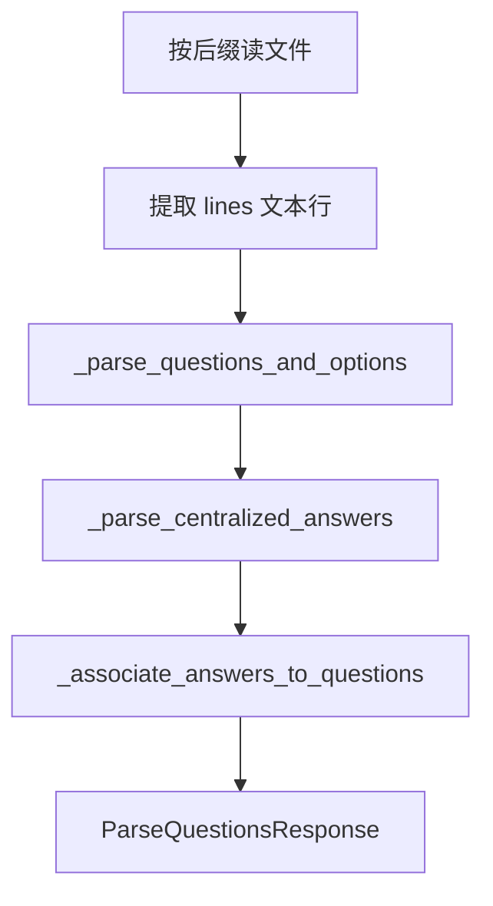

# 第 5 天：后端解析管线

**目标（3h）**：能讲三阶段管道，不要求背全文件正则。

## 1. 入口

`POST /api/parse-questions` → `parse_uploaded_file(filename, bytes)` in `backend/app/parser.py`

## 2. 三阶段（面试背这段）



### 阶段 A：提取行

| 后缀 | 方式 |
|------|------|
| `.docx` | python-docx |
| `.doc` | LibreOffice `soffice` 转 docx 再解析 |
| `.pdf` | pdfplumber |
| `.xls/.xlsx` | openpyxl |

不支持格式 → `ValueError("文件格式不支持...")` → HTTP 422

### 阶段 B：题目与选项

- 题型段：`TYPE_SECTION_RE`（单选/多选/判断）
- 题干：`QUESTION_RE`（`1.` `1、` `1)`）
- 选项：`OPTION_RE`（`A.` …）
- 行内答案：`ANSWER_RE`

### 阶段 C：集中答案

- 识别「参考答案」段：`ANSWERS_SECTION_START_RE`
- 行格式：`CENTRALIZED_ANSWER_LINE_RE`（`1. B`）
- `_associate_answers_to_questions` 把答案挂到题号

## 3. 正则（知道用途即可）

- `QUESTION_RE` / `OPTION_RE` / `ANSWER_RE`
- 不支持格式、0 题 → `ValueError` → 前端显示 `detail`

## 4. 自测答案

**Q: .doc 为何要 LibreOffice？**  
A: python-docx 不读二进制 .doc，需 soffice 转成 docx。

**Q: 解析失败用户看到什么？**  
A: 422 + `detail` 中文说明；500 为未捕获异常。

## 5. 测试

```bash
cd backend && python -m pytest tests/ -v
```

见 `backend/tests/test_parser.py` 与 `backend/tests/fixtures/sample_quiz.txt`
