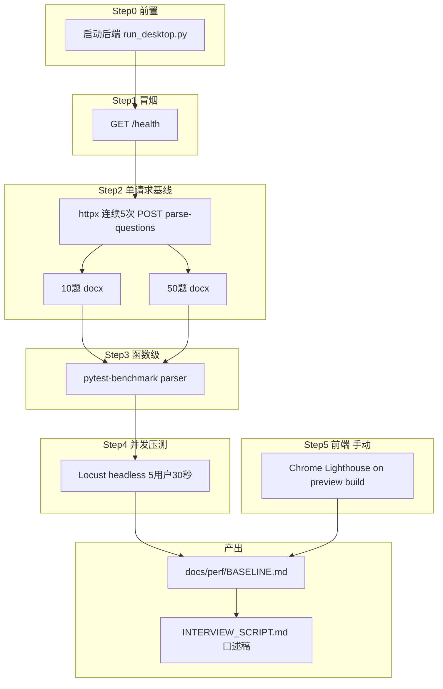

# happyfri 性能测试链路

一条从 **冒烟 → 单请求基线 → 函数 benchmark → 接口压测 → 前端 Lighthouse** 的完整链路。

**最快上手**：[QUICKSTART.md](./QUICKSTART.md)（5 分钟讲清楚 + 一键命令）

---

## 链路总览（面试先画这张）



---

## 为什么这样测（你要能讲清楚）

| 层级 | 测什么 | 用什么 | 说明 |
|------|--------|--------|------|
| L0 冒烟 | 服务是否存活 | `/health` | 排除「根本没启动」 |
| L1 单请求 | 解析耗时基线 | `run_perf_baseline.py` | 无并发，看 10 题 vs 50 题差异 |
| L2 函数 | CPU 纯解析 | pytest-benchmark | 不经过 HTTP，定位是否在 parser |
| L3 接口 | 吞吐与 P95 | Locust | 模拟多用户同时上传 |
| L4 前端 | 首屏与交互 | Lighthouse + Performance | 必须 `npm run preview` 生产包 |

**项目特点**：没有数据库；答题在浏览器 Zustand 里，**不重复打 API**。性能瓶颈几乎都在 `POST /api/parse-questions` 的同步解析。

---

## 一键跑后端基线（推荐）

### 终端 1：启动后端

```bash
cd backend
python -m pip install -r requirements-dev.txt
python run_desktop.py
```

### 终端 2：生成报告

```bash
cd backend
python scripts/run_perf_baseline.py
```

输出：`docs/perf/BASELINE.md`（含 health、单请求 P50/P95、benchmark、Locust 表）

Windows 也可：

```powershell
.\scripts\perf\run-backend-baseline.ps1
```

---

## 分步手动跑（面试说「我分层验证」）

### Step 1 — 冒烟

```bash
curl http://127.0.0.1:8000/health
```

期望：`{"status":"ok"}`

### Step 2 — Swagger 单接口体感

浏览器打开 http://127.0.0.1:8000/docs → `POST /api/parse-questions` 上传 docx，看响应时间。

### Step 3 — pytest-benchmark

```bash
cd backend
python -m pytest tests/test_parser_perf.py --benchmark-only
```

### Step 4 — Locust 可视化压测

```bash
cd backend
locust -f locustfile.py --host=http://127.0.0.1:8000
```

打开 http://localhost:8089，建议：**5 用户**摸底，再试 **20 用户**看 P95 拐点。

无界面：

```bash
locust -f locustfile.py --host=http://127.0.0.1:8000 --headless -u 5 -r 1 -t 30s
```

### Step 5 — 前端

见 [FRONTEND_CHECKLIST.md](./FRONTEND_CHECKLIST.md)

---

## 仓库内文件地图

| 文件 | 作用 |
|------|------|
| [`backend/scripts/run_perf_baseline.py`](../../backend/scripts/run_perf_baseline.py) | 一键 L1–L4 后端，写 BASELINE.md |
| [`backend/locustfile.py`](../../backend/locustfile.py) | Locust 场景：10 题/50 题 docx + health |
| [`backend/tests/test_parser_perf.py`](../../backend/tests/test_parser_perf.py) | parser 函数 benchmark |
| [`backend/tests/helpers.py`](../../backend/tests/helpers.py) | 生成测试用 docx |
| [`INTERVIEW_SCRIPT.md`](./INTERVIEW_SCRIPT.md) | 3 分钟口述稿 |
| [`BASELINE.md`](./BASELINE.md) | 实测数据（跑脚本后更新） |

---

## 读结果：什么叫「有问题」

- **10 题 P95 正常、50 题 P95 成倍涨**：符合预期，解析与题量近似线性。
- **5 并发 P95 暴涨 + CPU 100%**：同步 parser 阻塞 event loop，需线程池 / 多 worker。
- **Locust 出现大量 422**：检查上传字段名必须是 `file`。
- **前端 Lighthouse LCP 差**：查首屏大图 `home-bg.png`、主 bundle 体积。

---

## 面试 30 秒版

> 我把链路拆成五层：health 冒烟、单请求建立 P50/P95 基线、pytest-benchmark 隔离 parser CPU、Locust 看 5 并发下的吞吐和 P95，前端用生产 build 跑 Lighthouse。结论是瓶颈在 parse-questions 同步解析，优化方向是异步化解析和多 worker。

详细口述：[INTERVIEW_SCRIPT.md](./INTERVIEW_SCRIPT.md)
